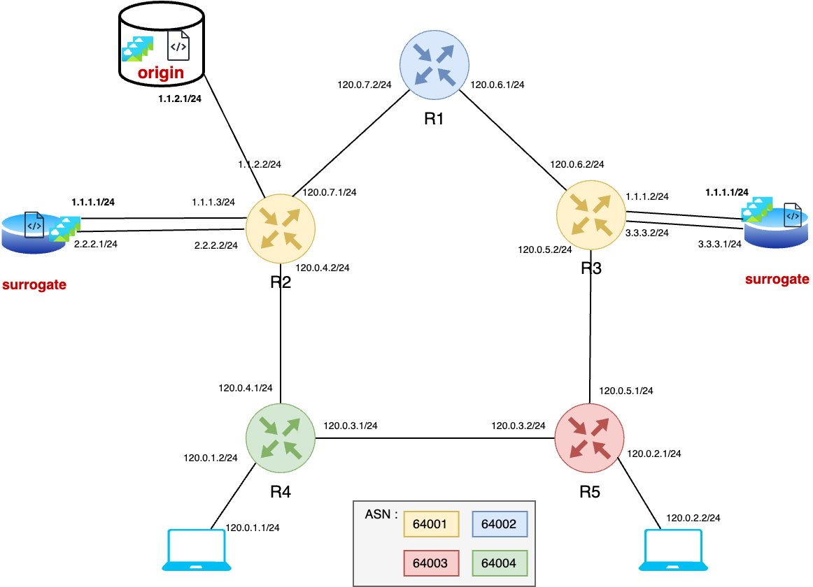

# CDN project

## Presentation

## Diagram

## Choices
**- User/CDN communication:** BGP Anycast

**- File retrieving strategy:**  
	1. Intra-cluster caching (cache miss => query to origin)   
	2. Digest-based (cache miss => check digest => query to file owner)

**- Cache management strategy:** The Least Recently Used (LRU)  

**- Cache size:** 3MB in each surrogate server  

**- File size:** 1MB

This project implements a simple Content Delivery Network (CDN) using Python and Flask. It consists of:

**Origin Server**: Stores original content and manages distribution using a Distributed Hash Table (DHT).

**Surrogate Servers**: Cache content from the Origin Server and serve it to clients using an LRU Cache for efficient storage management.

**Client Application:** Requests content from Surrogate Servers and plays it using VLC.

**Tests:** Validates the LRU Cache functionality.

## Getting Started
To build Docker images for each component, run the following commands from the root directory of the project:

	`docker build -t origin_server_image ./origin_server`  
	`docker build -t surrogate_server_image ./surrogate_servers`  
	`docker build -t client_app_image ./client_app`

### Running Containers
Run the containers for each component:

	`docker run -d --name origin_server -p 5000:5000 -p 8468:8468 origin_server_image`  
	`docker run -d --name surrogate_server -p 5001:5001 -p 8469:8469 surrogate_server_image` 
	`docker run -it --name client_app client_app_image` 

### Uploading Content to the Origin Server
	`ffmpeg -f lavfi -i testsrc=duration=10:size=640x360:rate=30 sample_video.mp4`  

Upload the File Using curl:
	`curl -X POST -F "content_id=sample_video.mp4" -F "file=@sample_video.mp4" http://localhost:5000/upload`  

